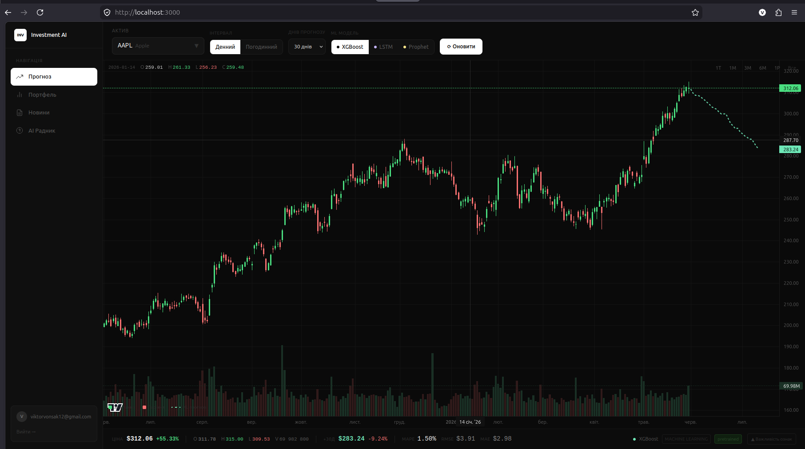
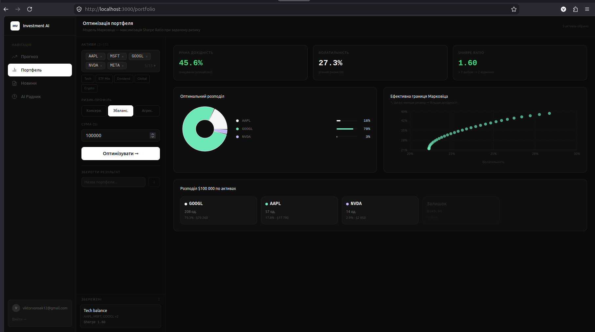
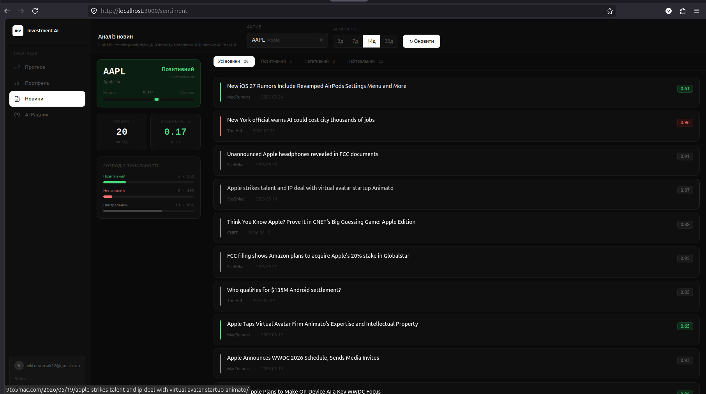
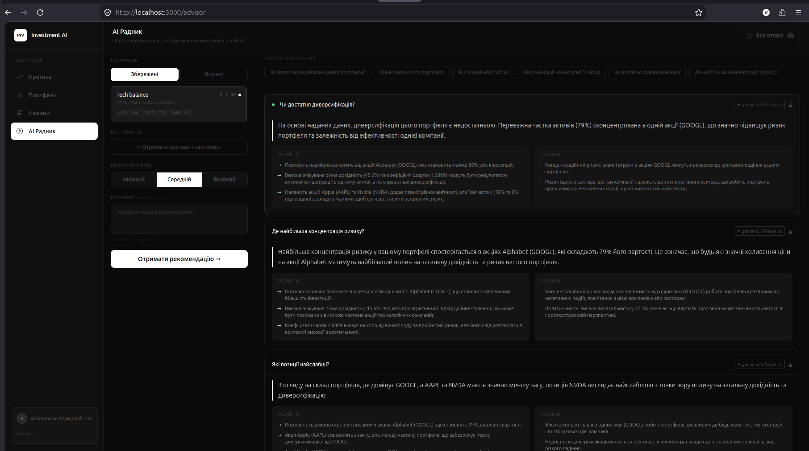

# Investment AI Assistant

> *Веб-застосунок для інтелектуального аналізу фінансових ринків: ML-прогнозування цін, оптимізація портфеля за Марковіцем, аналіз новинного сентименту та AI-рекомендації на базі Gemini 2.5 Flash.*

---

## Автор

- **ПІБ**: Вонсяк Віктор Васильович
- **Група**: ФЕІ-45
- **Керівник**: Бовгира Олег Вікторович, кандидат фізико-математичних наук, доцент кафедри радіоелектронних і комп’ютерних систем
- **Дата виконання**: 31 травня 2026

---

## Загальна інформація

- **Тип проекту**: Веб-застосунок (SPA + REST API)
- **Мови програмування**: Python 3.12, TypeScript
- **Фреймворки / Бібліотеки**:
  - Backend: FastAPI, SQLAlchemy, asyncpg
  - Frontend: React 18, Tailwind CSS, lightweight-charts, Recharts
  - ML: XGBoost, PyTorch (LSTM), Prophet, FinBERT (transformers), PyPortfolioOpt
  - AI: Google Gemini 2.5 Flash
  - БД: PostgreSQL

---

## Опис функціоналу

- **Прогнозування цін** — три ML-моделі (XGBoost, LSTM, Prophet) на денному та погодинному інтервалах для 50+ активів
- **Оптимізація портфеля** — алгоритм Марковіца, максимізація Sharpe Ratio, ефективна межа, дискретний розподіл коштів
- **Аналіз новин** — FinBERT sentiment analysis фінансових новин через NewsAPI з розбивкою по тональності
- **AI Радник** — персональні рекомендації Gemini 2.5 Flash з урахуванням ML-прогнозів та новинного сентименту
- **Автентифікація** — JWT-авторизація, реєстрація з MX-валідацією email, збереження портфелів і історії запитів

---

## Опис основних файлів

| Файл / Модуль | Призначення |
|---|---|
| `backend/main.py` | Точка входу FastAPI, підключення роутерів |
| `backend/api/routes/forecast.py` | REST API прогнозування цін |
| `backend/api/routes/portfolio.py` | REST API оптимізації портфеля |
| `backend/api/routes/sentiment.py` | REST API аналізу новин |
| `backend/api/routes/advisor.py` | REST API AI-рекомендацій (Gemini) |
| `backend/api/routes/auth.py` | Реєстрація та вхід (JWT) |
| `backend/ml/forecasting/xgboost_model.py` | XGBoost регресор з 18 технічними індикаторами |
| `backend/ml/forecasting/lstm_model.py` | LSTM нейромережа (PyTorch) |
| `backend/ml/forecasting/prophet_model.py` | Prophet часові ряди з сезонністю |
| `backend/ml/portfolio/optimizer.py` | Оптимізатор Марковіца (PyPortfolioOpt) |
| `backend/ml/sentiment/finbert_analyzer.py` | FinBERT sentiment аналізатор |
| `backend/data/market_data.py` | Завантаження OHLCV даних через yfinance |
| `backend/db/models.py` | SQLAlchemy моделі: User, Portfolio, AdvisorQuery |
| `backend/train.py` | CLI-скрипт попереднього навчання XGBoost/LSTM |
| `frontend/src/pages/ForecastPage.tsx` | Сторінка прогнозування з candlestick-графіком |
| `frontend/src/pages/PortfolioPage.tsx` | Сторінка оптимізації портфеля |
| `frontend/src/pages/SentimentPage.tsx` | Сторінка аналізу новин |
| `frontend/src/pages/AdvisorPage.tsx` | Сторінка AI-радника |
| `frontend/src/components/ui/FinancialChart.tsx` | TradingView-подібний candlestick графік (lightweight-charts) |
| `frontend/src/services/api.ts` | Axios-клієнт для всіх API запитів |

---

## Як запустити проект "з нуля"

### 1. Необхідне програмне забезпечення

- Python 3.12+
- Node.js 20+ та npm
- PostgreSQL 15+

### 2. Клонування репозиторію

```bash
git clone https://github.com/VONSAIK/Diploma.git
cd Diploma
```

### 3. Налаштування Backend

```bash
# Створити та активувати віртуальне середовище
python -m venv venv
source venv/bin/activate  # Linux/Mac
# або: venv\Scripts\activate  # Windows

# Встановити залежності
pip install -r backend/requirements.txt
```

### 4. Створення `.env` файлу

Скопіювати шаблон та заповнити своїми ключами:

```bash
cp .env.example .env
```

Отримати ключі:
- **GEMINI_API_KEY** — безкоштовно на [aistudio.google.com](https://aistudio.google.com/app/apikey)
- **NEWS_API_KEY** — безкоштовно на [newsapi.org](https://newsapi.org)
- **DATABASE_URL** — замінити `user`, `password`, `investment_db` на свої дані PostgreSQL
- **SECRET_KEY** — довільний рядок (наприклад: `openssl rand -hex 32`)

### 5. Створення бази даних

```bash
# PostgreSQL
createdb investment_db
# Таблиці створяться автоматично при першому запуску
```

### 6. Запуск Backend

```bash
source venv/bin/activate
cd backend
uvicorn main:app --reload --port 8000
```

### 7. Встановлення та запуск Frontend

```bash
cd frontend
npm install
npm run dev
```

Застосунок доступний за адресою: **http://localhost:3000**

---

## API Приклади

### Автентифікація

**POST /api/auth/register**

```json
{
  "email": "user@example.com",
  "password": "123456"
}
```

**Response:**

```json
{
  "access_token": "jwt_token",
  "token_type": "bearer",
  "user_id": 1,
  "email": "user@example.com"
}
```

---

### Прогнозування

**GET /api/forecast/{ticker}?steps=30&model=xgboost&interval=1d**

```json
{
  "ticker": "AAPL",
  "model": "xgboost",
  "history": [...],
  "predictions": [
    { "date": "2026-06-02", "price": 201.45 }
  ],
  "metrics": {
    "cv_mape": 2.34,
    "cv_rmse": 4.12
  }
}
```

---

### Оптимізація портфеля

**POST /api/portfolio/optimize**

```json
{
  "tickers": ["AAPL", "MSFT", "GOOGL"],
  "risk_tolerance": "medium",
  "portfolio_value": 10000
}
```

**Response:**

```json
{
  "weights": { "AAPL": 0.45, "MSFT": 0.35, "GOOGL": 0.20 },
  "expected_annual_return": 0.18,
  "annual_volatility": 0.22,
  "sharpe_ratio": 1.54
}
```

---

### AI Радник

**POST /api/advisor/recommend**

```json
{
  "portfolio": { "AAPL": 0.5, "MSFT": 0.5 },
  "risk_tolerance": "medium",
  "question": "Чи варто зараз ребалансувати?"
}
```

---

## Інструкція для користувача

1. **Реєстрація / Вхід** — створіть акаунт або увійдіть на сторінці `/login`

2. **Прогноз цін** (головна сторінка):
   - Оберіть актив зі списку 50+ тікерів
   - Виберіть модель: XGBoost / LSTM / Prophet
   - Виберіть інтервал: Денний / Погодинний
   - Встановіть горизонт прогнозу (до 90 днів)

3. **Оптимізація портфеля**:
   - Додайте від 2 до 15 активів
   - Оберіть ризик-профіль (Консервативний / Збалансований / Агресивний)
   - Введіть суму інвестицій
   - Натисніть «Оптимізувати» — система знайде оптимальні ваги
   - Збережіть результат для використання в AI Раднику

4. **Аналіз новин**:
   - Оберіть тікер і часовий діапазон (3 / 7 / 14 / 30 днів)
   - FinBERT проаналізує новини та покаже sentiment-сигнал

5. **AI Радник**:
   - Оберіть збережений портфель або введіть вручну
   - За бажанням завантажте ML-сигнали (прогноз + сентимент)
   - Поставте питання або скористайтесь готовими шаблонами
   - Отримайте рекомендацію від Gemini 2.5 Flash

---

## Скріншоти

| Сторінка | Опис |
|---|---|
|  | Candlestick графік з ML-прогнозом |
|  | Оптимізація та ефективна межа Марковіца |
|  | FinBERT аналіз новинного сентименту |
|  | Персональні рекомендації Gemini |

*(додайте зображення у папку `/screenshots/`)*

---

## Проблеми та рішення

| Проблема | Рішення |
|---|---|
| `Address already in use` при запуску бекенду | `lsof -ti:8000 \| xargs kill -9` |
| Помилка підключення до БД | Перевірити `DATABASE_URL` у `.env` та що PostgreSQL запущено |
| Gemini не відповідає | Перевірити `GEMINI_API_KEY`, є fallback на rule-based рекомендації |
| LSTM/XGBoost довго завантажується | Перший запит тренує модель (~10-30с), наступні використовують кеш |
| Новини не знаходяться | Перевірити `NEWS_API_KEY`, безкоштовний план має обмеження |

---

## Використані джерела / Література

- Markowitz, H. (1952). Portfolio Selection. *Journal of Finance*
- Chen, T., & Guestrin, C. (2016). XGBoost: A Scalable Tree Boosting System
- Hochreiter, S., & Schmidhuber, J. (1997). Long Short-Term Memory. *Neural Computation*
- Taylor, S., & Letham, B. (2018). Forecasting at Scale (Prophet). *American Statistician*
- Huang, A. et al. (2023). FinBERT: Financial Sentiment Analysis with BERT
- FastAPI офіційна документація — https://fastapi.tiangolo.com
- PyPortfolioOpt документація — https://pyportfolioopt.readthedocs.io
- React офіційна документація — https://react.dev
- lightweight-charts — https://tradingview.github.io/lightweight-charts
